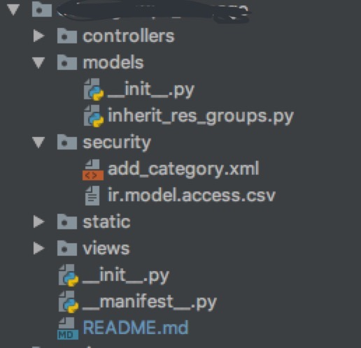

# odoo_groups_manage  
本模块在*春哥*与*武龙*开发的权限组功能的基础上修改完成，依赖`vue_template_manager`与`layui_theme`模块，请保证这两个模块存在  
注: 使用该权限组模块后可能导致现有项目里部分groups的implied_ids受到影响，请务必多测试

***
#### 使用说明：  
1. 首先需要在现有项目里依赖该模块，在`__manifest__.py`文件中写入：  
    `'depends': [**其他依赖模块, 'odoo_groups_manage'],`

2.  然后在现有项目里写入一个默认的自定义权限`category`，一般是用`xml`文件做成项目初始加载数据，例如：  
   
    1. 
        <div>
        
        (这里的security/add_category.xml便是我初始加载category或者group的文件)
        </div>

        `add_category.xml`文件的内容:  (这只是例子，id请自行命名，不必照搬)
        ```xml
        <?xml version="1.0" encoding="UTF-8" ?>
        <odoo>
            <data noupdate="1">
                <record model="ir.module.category" id="this_catetory_id">
                    <field name="name">自定义角色组</field>
                </record>
            </data>
        </odoo>
        ```

    2. 
        然后在`__manifest__.py`中引入这个`xml`文件
        ```python
        'data': [
             # 'security/ir.model.access.csv',
             'security/add_category.xml', # 在这里引入了xml文件
             'views/depend_static.xml',
             'views/res_groups_view.xml',
         ],
         ```

    这样就完成了默认自定义groups的初始导入，以后自定义的组都将归类在这个`category`下

3.  建议另外创建一个xml文件用来初始导入现有项目需要使用的`groups`权限组，例如：    
   新建一个`xml`文件，文件内容：
    ```xml
    <?xml version="1.0" encoding="utf-8"?>
        <odoo>
            <data noupdate="1">
                <record model="ir.module.category" id="category_fuenc1">
                    <field name="name">生产管理系统</field>
                </record>

                <record model="res.groups" id="system_fuenc_tester1">
                    <field name="name">交接班</field>
                    <field name="category_id" ref="category_fuenc1"/>
                </record>
                <!--添加该category下其他group-->

                <record model="ir.module.category" id="category_fuenc2">
                    <field name="name">运作管理系统</field>
                </record>

                <record model="res.groups" id="system_fuenc_tester2">
                    <field name="name">属地管理</field>
                    <field name="category_id" ref="category_fuenc2"/>
                </record>
                <!--添加该category下其他group-->
            </data>
        </odoo>
    </xml>
    ```
    然后在`__manifest__.py`中引入这个`xml`文件  
    ```python
    'data': [
        # 'security/ir.model.access.csv',
        'security/add_category.xml',
        'security/add_other_category.xml', # 在这里引入了该xml文件
        'views/depend_static.xml',
        'views/res_groups_view.xml',
    ],
    ```  

4.  接下来在现有项目里创建一个新`module`，继承`res.groups`模型，并改写`get_config_info`函数
    ```python
    from odoo import models


    class ExtendResGroup(models.Model):
        _inherit = 'res.groups'

        @staticmethod
        def get_config_info():
            '''
            该函数返回一个dict, 共有4个key,
            key: module_name 当前项目的module名，一般是__manifest__.py中的name对应的值，category_id_list会在此module下搜索相应的id
            key: category_id_list 需要展示group的对应的category的id的列表，这个id不包含自定义的组category的id
            key: custom_group_id 自定义的组category的id
            :return:
            '''
            return {
                'module_name': '', 'category_id_list': [], 'custom_group_id': ''}
    ```
5.  下一步就是将管理权限组的界面展示出来，在现有项目的view视图里添加
    ```xml
    <odoo>
        <data>
            <record id="act_id" model="ir.actions.act_window">
                <field name="name">角色组</field>
                <field name="res_model">res.groups</field>
                <field name="view_mode">tree,form</field>
                <!-- domain字段的ref内容改为现有项目的module.自定义角色组cateroty的id -->
                <field name="domain"
                    eval="[('category_id', '=', ref('modules.this_catetory_id'))]"/>
                <!-- view_ids字段的内容不要变 -->
                <field name="view_ids" eval="[(5, 0, 0),
                (0, 0, {'view_mode': 'tree', 'view_id': ref('odoo_groups_manage.odoo_groups_manage_res_groups_tree')})]"/>
            </record>

            <menuitem id="menu_id" name="角色组管理" action="act_id"/>
        </data>
    </odoo>
    ```
这样就可以在左侧导航看见相应的入口了  

***  
#### 其他用法： 
1.  因为使用的是tree状图结构，所以可以定义树的节点与children节点，使用方法如下：  
    在创建初始导入group数据时，将`xml`文件分层级创建，并在叶节点的group里添加`parent_id`字段，字段内容是父节点`group`的id   
    *注：内容只能是`group`的id，不能是`category`的id，使用tree状图时py文件中的`get_config_info()`函数中的`category_id_list`只需要返回最顶层的group的id即可，会自动递归向下搜寻*  

    例如：
    现在需要创建一个三级的tree权限管理图，所以创建了三个`xml`文件来创建每一层的初始group，分别为
    `first_view.xml`， `second_view.xml`, `third_view.xml`.

    > first_view.xml  

    ```xml
    <?xml version="1.0" encoding="utf-8"?>
    <odoo>
        <data noupdate="1">
            <record model="ir.module.category" id="category_fuenc1">
                <field name="name">生产管理系统</field>
            </record>

            <record model="res.groups" id="system_fuenc_tester1">
                <field name="name">交接班</field>
                <field name="category_id" ref="category_fuenc1"/>
            </record>
        </data>
    </odoo>
    ```  

    > second_view.xml  

    ```xml
    <?xml version="1.0" encoding="utf-8"?>
    <odoo>
        <data noupdate="1">
            <record model="ir.module.category" id="category_fuenc2">
                <field name="name">运作管理系统</field>
            </record>

            <record model="res.groups" id="system_fuenc_tester2">
                <field name="name">属地管理</field>
                <!-- ref值对应上面交接班group的id -->
                <field name="parent_id" ref="system_fuenc_tester1"/>
                <field name="category_id" ref="category_fuenc2"/>
            </record>
        </data>
    </odoo>
    ```  

    > third_view.xml  

    ```xml
    <?xml version="1.0" encoding="utf-8"?>
    <odoo>
        <data noupdate="1">
            <record model="ir.module.category" id="category_fuenc3">
                <field name="name">交接班按钮</field>
            </record>

            <record model="res.groups" id="system_fuenc_tester3">
                <field name="name">属地管理-按钮1</field>
                <!-- ref值对应上面属地管理group的id -->
                <field name="parent_id" ref="system_fuenc_tester2"/>
                <field name="category_id" ref="category_fuenc3"/>
            </record>
        </data>
    </odoo>
    ```  

    **然后在`__manifest__.py`中按从父级到叶级的顺序导入**  
    ```python
    'data': [
        # 'security/ir.model.access.csv',
        'security/add_category.xml', 
        '/路径/first_view.xml', # 在这里引入了文件
        '/路径/second_view.xml',
        '/路径/third_view.xml',
        'views/depend_static.xml',
        'views/res_groups_view.xml',
    ],
    ```
2. 如果对展示的权限组排列顺序有需求，可以在创建初始group的`xml`中添加`sequence`字段，内容必须是int型正数，展示时同级节点按值小到大进行排列 
例：
```xml
<?xml version="1.0" encoding="utf-8"?>
    <odoo>
        <data noupdate="1">
            <record model="ir.module.category" id="category_fuenc1">
                <field name="name">生产管理系统</field>
            </record>

            <record model="res.groups" id="system_fuenc_tester1">
                <field name="name">交接班</field>
                <field name="sequence">1</field>
                <field name="category_id" ref="category_fuenc1"/>
            </record>

            <record model="res.groups" id="system_fuenc_tester2">
                <field name="name">属地管理</field>
                <field name="sequence">2</field>
                <field name="category_id" ref="category_fuenc2"/>
            </record>

            <record model="ir.module.category" id="category_fuenc3">
                <field name="name">交接班按钮</field>
            </record>

            <record model="res.groups" id="system_fuenc_tester3">
                <field name="name">属地管理-按钮1</field>
                <field name="sequence">3</field>
                <field name="category_id" ref="category_fuenc3"/>
            </record>
        </data>
    </odoo>
```
使用中有好的优化建议或发现bug欢迎积极讨论